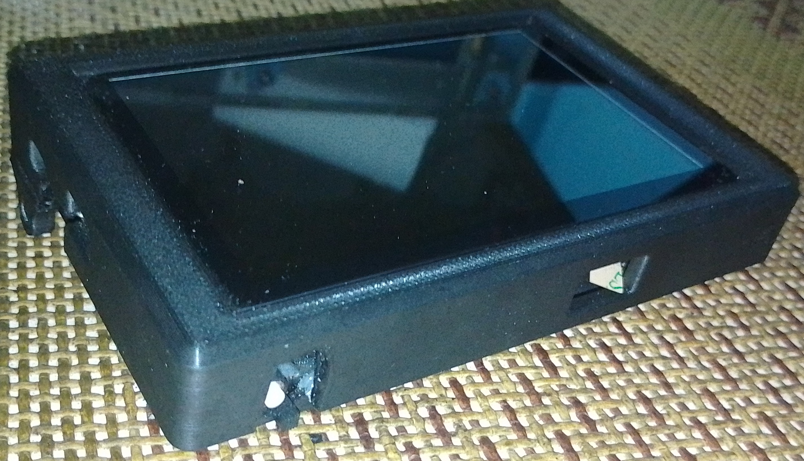
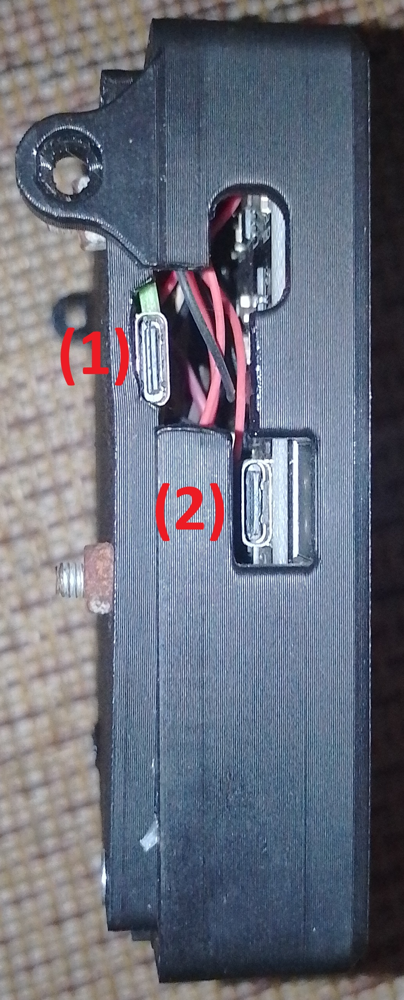
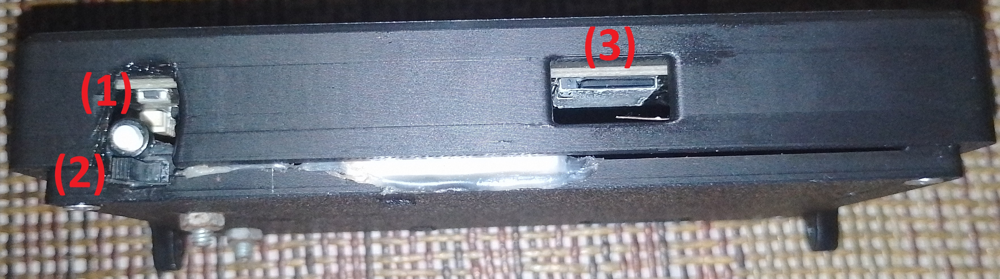
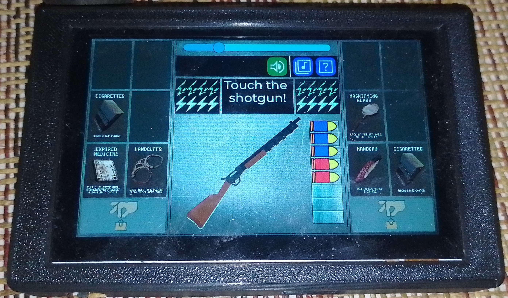
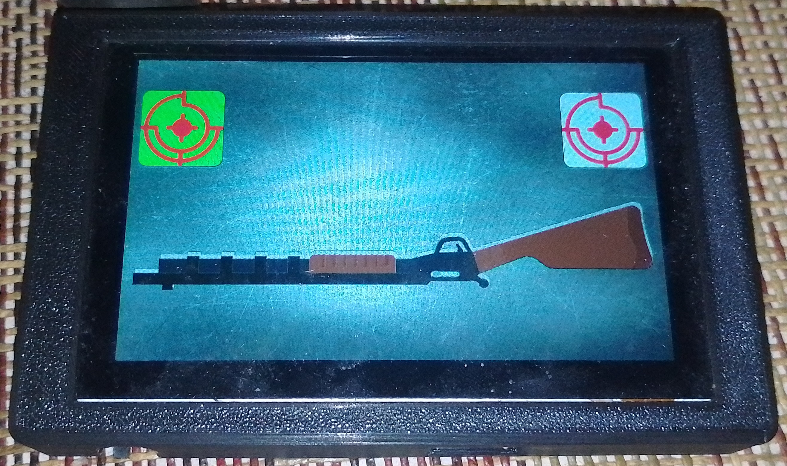
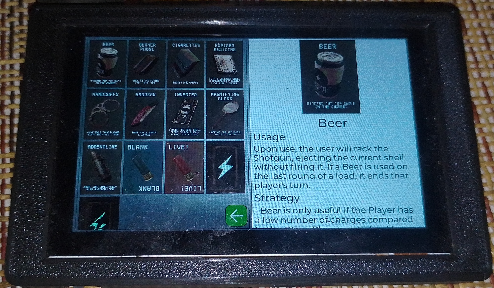
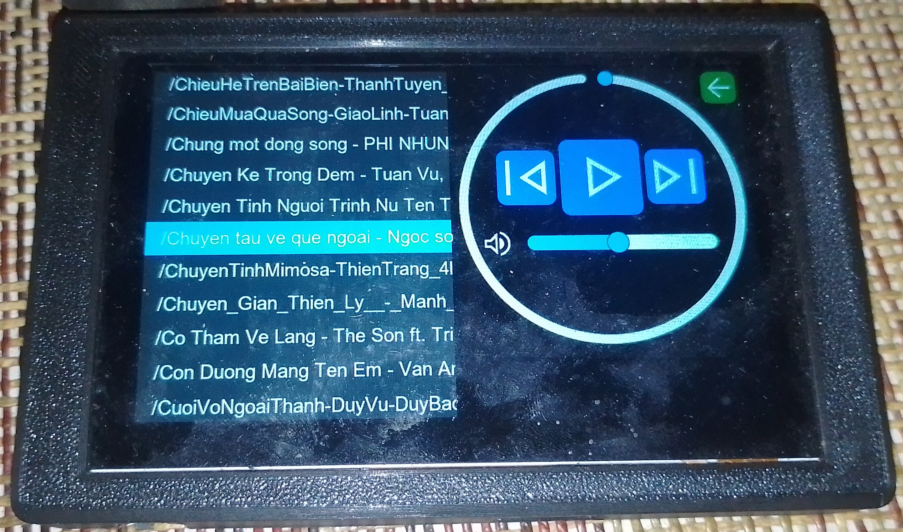

# 1. Tổng quan thiết bị

> Mặt trước: Màn hình cảm ứng điện dung 5 inch\

> Mặt trái: các cổng kết nối type-C
> 1. Cổng sạc pin li-po
> 2. Cổng nạp code

> Mặt dưới:
> 1. Nút nhấn kiểm tra dung lượng pin
> 2. Switch công tắc nguồn thiết bị
> 3. Khe cắm thẻ nhớ micro-SD

# 2. Các màn hình trên thiết bị

## 2.1. Màn hình chơi game

### 2.1.1. Màn hình chính
> Hiển thị các nút điều hướng như chỉnh độ sáng màn hình, bật/tắt âm thanh, mở chức năng hỗ trợ; hiển thị các item dạng lá bài của mỗi người chơi, số lượng HP, khẩu shotgun và hộp tiếp đạn.

### 2.1.2. Màn hình shotgun
> Hiển thị khẩu shotgun và các button chọn người chơi để shot.

Và còn nhiều màn hình phụ khác để người chơi tự khám phá...

## 2.2. Màn hình trợ giúp
> Hiển thị thông tin về chức năng của các item.

## 2.3. Màn hình nghe nhạc
> Hiển thị danh sách các bài hát trong thẻ nhớ. Chọn bài hát để nghe, điều hướng giữa các bài hát, chỉnh âm lượng.\
> Hỗ trợ mọi định dạng bài hát (wav, mp4, acc, ...).

# 3. Ưu/Nhược điểm, hướng phát triển của thiết bị
## 3.1. Ưu điểm
- Thiết bị gọn gàng, dễ mang theo.
- Với dung lượng pin 2000mAh, có thể lưu trữ thiết bị trong vài tháng mà không cạn pin.
- Giao diện dễ thao tác và sử dụng.

## 3.2. Nhược điểm
- Bài hát chỉ nghe rõ và tốt khi để âm lượng vừa đủ, âm lượng quá lớn sẽ bị rè.

## 3.3. Hướng phát triển
- Hỗ trợ đa ngôn ngữ.
- Tích hợp mô hình AI nhỏ để làm bot khi chơi 1 người.
