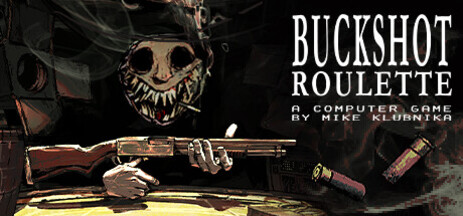
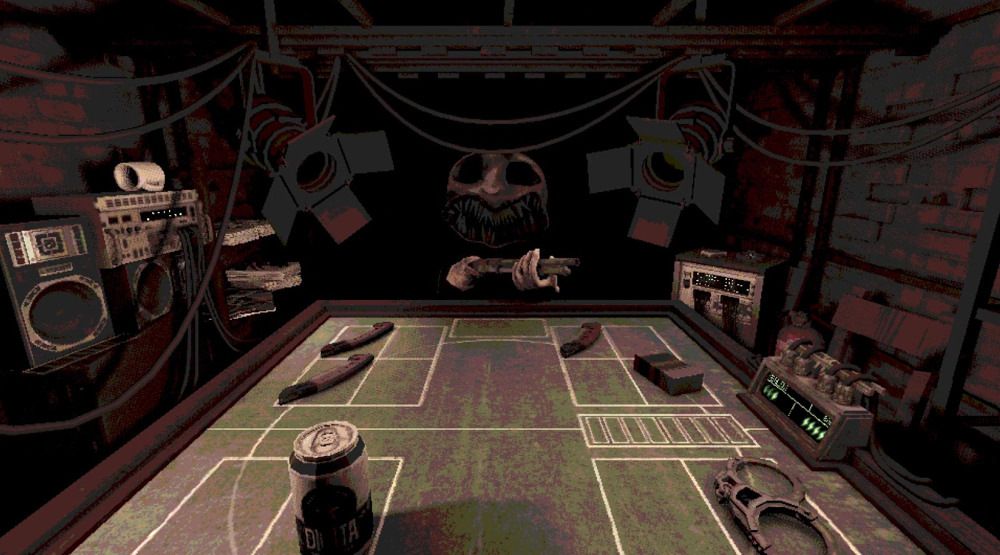
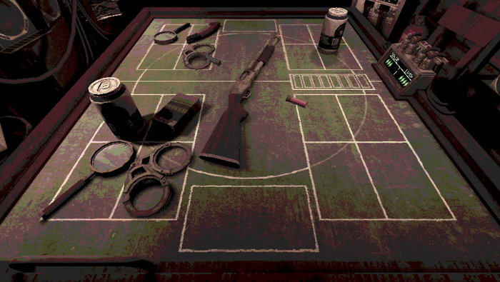
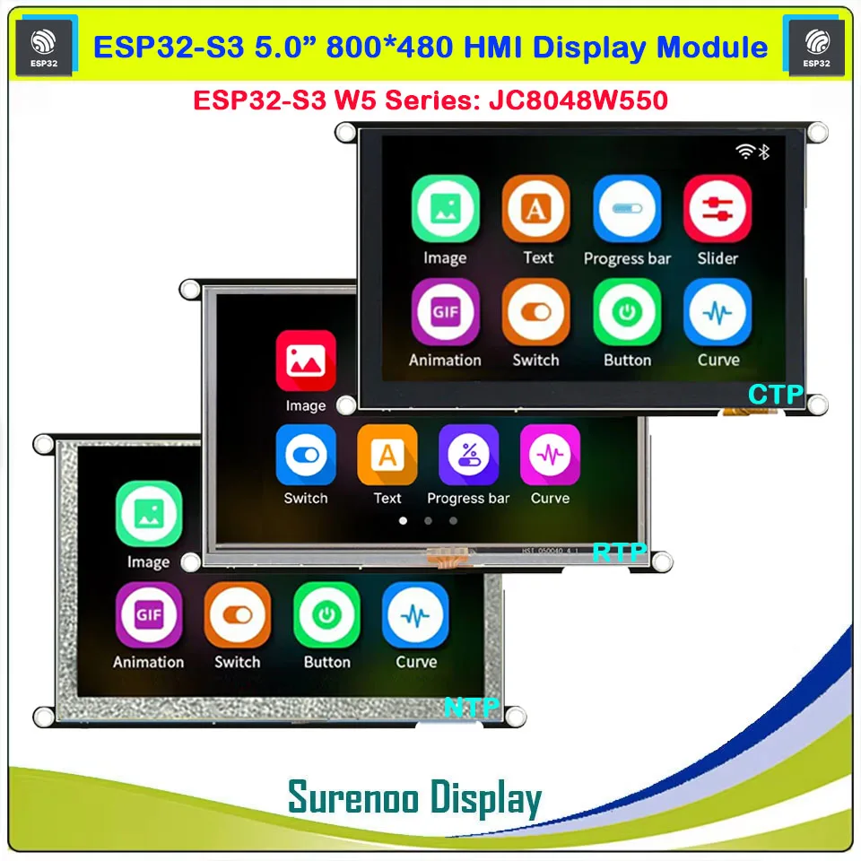
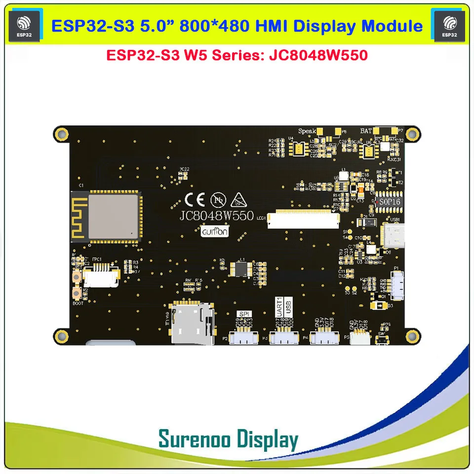

# 1. Tổng quan
## 1.1. Buckshot Roulette
Buckshot Roulette không chỉ là một trò chơi, đó là một trải nghiệm tâm lý đầy nghẹt thở, nơi ranh giới giữa vận may rủi và tư duy chiến thuật bị xóa nhòa. Được nhào nặn bởi bàn tay của nhà phát triển tài năng Mike Klubnika, trò chơi đưa bạn vào một căn phòng u tối, ngột ngạt tại một câu lạc bộ đêm dưới lòng đất, nơi bạn phải đối đầu với The Dealer — một thực thể kỳ quái và lạnh lùng — trong một ván cược sinh tử.

Điểm nhấn cốt lõi của trò chơi:
- Vòng quay Shotgun 12-Gauge: Thay vì khẩu lục quay truyền thống, trò chơi sử dụng một khẩu shotgun đầy uy lực. Cảm giác nạp từng viên đạn thật (Live) và đạn giả (Blank) vào buồng đạn tạo nên một sức nặng vật lý mà hiếm trò chơi nào làm được.
- Chiều sâu chiến thuật: Đây là điểm "ăn tiền" nhất. Trò chơi cung cấp cho bạn các vật phẩm như Kính lúp để soi đạn, Cưa tay để tăng sát thương, hay Bao thuốc để xoa dịu thần kinh (hồi máu). Việc phối hợp các vật phẩm này biến một trò chơi may rủi thành một ván cờ trí tuệ thực thụ.
- Phong cách "Gritty" độc bản: Với phong cách đồ họa góc cạnh, thô ráp (lo-fi) gợi nhớ đến thời kỳ PSX kết hợp cùng âm thanh công nghiệp (industrial music) chát chúa, game tạo ra một bầu không khí bẩn thỉu, đáng sợ nhưng không thể rời mắt.
- Cược bằng mạng sống: Bạn không chơi vì tiền, bạn chơi để tồn tại. Mỗi quyết định bóp cò là một lần tim thắt lại, tạo nên sự kịch tính đạt đến đỉnh điểm.

Trang web chính thức của trò chơi: [https://buckshotroulette.com](https://buckshotroulette.com/home)

## 1.2. Các vật phẩm
Trong thế giới của Buckshot Roulette, may mắn chỉ là một biến số mà bạn có thể thao túng. Các vật phẩm (Items) không chỉ là công cụ hỗ trợ, chúng là những quân bài chiến lược giúp bạn lật ngược thế cờ khi họng súng đang chĩa thẳng vào đầu.

Dưới đây là mô tả về kho khí tài mà bạn sẽ sử dụng để đối đầu với cái chết:

- **Kính Lúp (Magnifying Glass)**: Xuyên thấu sự thật. Cho phép bạn soi thẳng vào buồng đạn để biết chắc chắn viên đạn tiếp theo là thật hay giả. Một cái nhìn giúp xóa tan mọi nỗi sợ hãi về sự ngẫu nhiên.
- **Cưa Tay (Hand Saw)**: Tàn bạo và dứt khoát. Dùng để cưa nòng khẩu shotgun, biến viên đạn thật tiếp theo thành đòn tấn công hủy diệt với sát thương gấp đôi. Một lựa chọn "được ăn cả, ngã về không".
- **Còng Tay (Handcuffs):** Khống chế cuộc chơi. Khóa chặt đối thủ, khiến họ mất đi lượt đi tiếp theo. Trong một trò chơi mà mỗi giây đều quý giá, việc khiến đối thủ bất động là lợi thế vô giá.
- **Bao Thuốc (Cigarettes):** Xoa dịu thần kinh. Một hơi thuốc để lấy lại sự bình tĩnh giữa cơn ác mộng. Vật phẩm này giúp bạn hồi phục một đơn vị máu (Defib Charge), kéo dài sự sống thêm một khoảnh khắc.
- **Lon Bia (Can of Beer):** Vứt bỏ rủi ro. Bằng cách bật nắp và uống hết lon, bạn tống khứ viên đạn hiện tại ra khỏi nòng súng mà không cần bóp cò. Một cách an toàn để loại bỏ những mối nguy hiểm không mong muốn.
- **Máy Khử Rung Tim (Defibrillator):** Cơ hội cuối cùng. Khi trái tim đã ngừng đập, đây là thiết bị đưa bạn trở về từ cõi chết. Một mạng sống dự phòng giúp bạn dám dấn thân vào những nước đi mạo hiểm nhất.

## 1.3. Buckshot Roulette Arduino
Dự án này là một phiên bản phần cứng độc lập, đưa trải nghiệm sinh tử của Buckshot Roulette lên nền tảng vi điều khiển ESP32. Không cần đến phụ kiện rườm rà, toàn bộ trò chơi được gói gọn trong một thiết bị cầm tay với giao diện tương tác trực quan qua màn hình cảm ứng, mang lại sự tiện lợi tối đa mà vẫn giữ trọn vẹn sự kịch tính của bản gốc.

### **Giao Diện Trực Quan và Tương Tác Chạm**

Trái tim của dự án là màn hình cảm ứng điện dung, nơi mọi thao tác từ chọn mục tiêu, sử dụng vật phẩm cho đến bóp cò đều được thực hiện qua những cú chạm. Giao diện được thiết kế với các phím bấm ảo có độ phản hồi hình ảnh sống động, giúp người chơi cảm nhận được sức nặng của từng quyết định.

### **Kho Vật Phẩm Kỹ Thuật Số (Virtual Items)**

Thay vì sử dụng thẻ bài vật lý, hệ thống quản lý vật phẩm được tích hợp ngay trên màn hình. Người chơi sẽ quản lý "túi đồ" của mình thông qua các biểu tượng đặc trưng:

- **Kính lúp, Cưa tay, Lon bia, Bao thuốc...** hiện diện dưới dạng các ô chọn thông minh.
- Chỉ với một cú chạm, hiệu ứng vật phẩm sẽ được thực thi ngay lập tức thông qua các hoạt ảnh (animation) trên màn hình, thay đổi trực tiếp thông số trận đấu.

### **Cơ Chế Nạp Đạn & Quản Lý Máu Thông Minh**

- **Số hóa sinh mạng:** Lượng máu của người chơi và đối thủ được hiển thị bằng các biểu tượng bộ khử rung tim (Defib) sắc nét, tự động cập nhật sau mỗi phát súng.
- **Thuật toán nạp đạn:** Trước mỗi vòng, hệ thống sẽ thông báo số đạn Thật/Giả. Thuật toán ngẫu nhiên của ESP32 sẽ "xáo trộn" các viên đạn trong buồng đạn ảo, đảm bảo mỗi lần bóp cò là một khoảnh khắc đối mặt với vận may hoàn toàn công bằng và không thể đoán trước.

Đây là sự kết hợp hoàn hảo giữa tính gọn nhẹ của công nghệ nhúng và sức hấp dẫn của lối chơi chiến thuật đỉnh cao, tạo nên một thiết bị giải trí độc đáo cho những tín đồ của dòng game kinh dị tâm lý.

**Tìm hiểu thêm:** [Màn hình cảm ứng Guition HMI W5 ESP32-S3-N16R8 JC8048W550 5.0 inch IPS 800*480](https://www.surenoo.com/products/23291185)

## **Tính Năng Mở Rộng: Trình Phát Nhạc Hi-Fi Từ Thẻ Nhớ**
Không chỉ dừng lại ở một máy chơi game chuyên dụng, thiết bị tận dụng tối đa sức mạnh xử lý âm thanh của ESP32 để trở thành một trình phát nhạc MP3 chuyên nghiệp. Thông qua khe cắm thẻ nhớ mở rộng, người chơi có thể biến thiết bị thành một máy nghe nhạc cá nhân với những đặc điểm nổi bật:

- **Quản Lý Thư Viện Nhạc Trực Quan:** Toàn bộ danh sách bài hát trong thẻ nhớ được hiển thị danh sách rõ ràng trên màn hình cảm ứng. Bạn có thể dễ dàng vuốt để chọn bài, chuyển bài (Next/Previous), tạm dừng (Pause) hoặc điều chỉnh âm lượng chỉ với một cú chạm nhẹ.
- **Âm Thanh Chất Lượng Cao:** Nhờ khả năng giải mã âm thanh mượt mà, thiết bị hỗ trợ phát các định dạng phổ biến với độ ổn định cao. Bạn có thể tự tạo cho mình những "playlist" mang phong cách *Industrial* hay *Dark Techno* để đồng bộ với không khí u tối của trò chơi, hoặc đơn giản là thưởng thức những bản nhạc yêu thích lúc nghỉ ngơi.
- **Cá Nhân Hóa Trải Nghiệm:** Giao diện nghe nhạc được thiết kế tinh giản nhưng hiện đại, đồng bộ với phong cách thẩm mỹ tổng thể của thiết bị. Đây là tính năng "bên lề" cực kỳ giá trị, giúp tăng tính ứng dụng của sản phẩm trong cuộc sống hàng ngày, biến nó từ một máy chơi game thuần túy thành một món đồ công nghệ đa nhiệm đầy cá tính.

## 1.4. LVGL
LVGL (viết tắt của Light and Versatile Graphics Library) là một thư viện đồ họa mã nguồn mở và miễn phí, được thiết kế đặc biệt để giúp các nhà phát triển dễ dàng xây dựng giao diện người dùng đồ họa (GUI) đẹp mắt, hiện đại và mượt mà trên các hệ thống nhúng có tài nguyên hạn chế như vi điều khiển.

Điểm mạnh cốt lõi của LVGL nằm ngay trong tên gọi của nó:

- Light (Nhẹ nhàng): LVGL được tối ưu hóa để hoạt động hiệu quả trên các chip có bộ nhớ RAM và flash khiêm tốn, cũng như tốc độ xử lý không quá cao. Điều này làm cho nó trở thành lựa chọn lý tưởng cho các thiết bị nhúng giá rẻ hoặc năng lượng thấp.
- Versatile (Linh hoạt): Thư viện hỗ trợ rất nhiều loại màn hình khác nhau (bao gồm cả màn hình màu TFT, màn hình đơn sắc, màn hình e-paper...) và các thiết bị nhập liệu đa dạng (màn hình cảm ứng điện trở/điện dung, nút nhấn, encoder, bàn phím...). 

LVGL cung cấp một bộ sưu tập phong phú các đối tượng giao diện dựng sẵn (gọi là widget) như nút, nhãn, thanh trượt, biểu đồ, danh sách, vùng văn bản..., cùng với hệ thống styling mạnh mẽ cho phép tùy chỉnh giao diện theo ý muốn.
Hơn nữa, LVGL hoạt động độc lập với phần cứng và hệ điều hành, cho phép dễ dàng tích hợp vào nhiều nền tảng vi điều khiển khác nhau (như ESP32, STM32, RP2040, v.v.) và chạy trên cả môi trường bare-metal hoặc cùng với các hệ điều hành thời gian thực (RTOS) phổ biến. Sự hỗ trợ từ cộng đồng lớn mạnh và khả năng tương thích với các công cụ thiết kế GUI trực quan như Squareline Studio càng làm tăng tốc độ và hiệu quả trong quá trình phát triển.

# 2. Phần mềm
Dự án được xây dựng dựa trên kiến trúc phần mềm phân lớp, được thiết kế để tách biệt rõ ràng các trách nhiệm (separation of concerns) giữa hiển thị, logic xử lý, thư viện dùng chung và môi trường phát triển mô phỏng. Cấu trúc này bao gồm bốn thành phần chính: **GUI, LIB, SER,** và **SIM**.

1. **GUI (Graphical User Interface)**
    * **Trách nhiệm:** **GUI** chịu trách nhiệm hoàn toàn về khía cạnh hiển thị và tương tác với người dùng trên màn hình cảm ứng.
    - **Chức năng:** Sử dụng thư viện đồ họa **LVGL** để vẽ và quản lý tất cả các yếu tố hình ảnh của các module bom (nút, dây, màn hình, hiệu ứng...). Lắng nghe và xử lý các sự kiện đầu vào từ màn hình cảm ứng (chạm, vuốt, nhấn giữ...).
    - **Tương tác:** Khi người dùng thực hiện một thao tác (ví dụ: chạm vào nút, cắt dây ảo), **GUI** sẽ thu nhận sự kiện này và gửi một yêu cầu xử lý tương ứng đến lớp xử lý (thông qua **LIB** đến **SER** trên phần cứng hoặc **SIM** cho môi trường mô phỏng). **GUI** cũng nhận dữ liệu trạng thái cập nhật từ lớp xử lý để cập nhật lại hiển thị trên màn hình.

2. **LIB (Library)**
    - **Trách nhiệm:** **LIB** là thư viện chứa các hàm và cấu trúc dữ liệu cốt lõi, được thiết kế để dùng chung giữa lớp xử lý chính (**SER**) và môi trường mô phỏng (**SIM**), và có thể được sử dụng bởi **GUI** để định nghĩa cấu trúc dữ liệu.
    - **Chức năng:** Nơi tạo ra hệ thống câu đố, đáp án của trò chơi, đồng thời cũng chứa các xử lý kiểm tra quy tắc cho từng loại module gỡ bom. Các xử lý này sẽ nhận đầu vào là thao tác của người dùng và trạng thái hiện tại của module, trả về kết quả (ví dụ: thành công, thất bại, cần thao tác tiếp theo, ...).
    - **Tương tác:** Cả **SER** và **SIM** đều gọi các hàm trong **LIB** để xác định kết quả của một thao tác gỡ bom dựa trên các quy tắc đã định sẵn. **LIB** đóng vai trò như bộ não chứa luật chơi, tách biệt khỏi việc xử lý sự kiện (**SER/SIM**) và hiển thị (**GUI**).

3. **SER (Service)**
    - **Trách nhiệm:** **SER** là trung tâm xử lý dành cho phần cứng khi dự án chạy trên phần cứng **ESP32** thực tế.
    - **Chức năng:** Nhận các yêu cầu xử lý thao tác từ **GUI**. Lớp này không tự kiểm tra quy tắc gỡ bom, mà sẽ gọi các hàm kiểm tra tương ứng trong **LIB** để xác định kết quả của thao tác đó. Dựa trên kết quả từ **LIB**, **SER** sẽ cập nhật trạng thái nội bộ của quả bom và các module (ví dụ: đánh dấu module đã gỡ thành công, kích hoạt hiệu ứng nổ...).
    - **Tương tác:** Nhận yêu cầu từ **GUI**, gọi hàm trong **LIB**, cập nhật trạng thái nội bộ, và gửi dữ liệu trạng thái cập nhật trở lại cho GUI để hiển thị. **SER** chịu trách nhiệm tương tác với các tài nguyên phần cứng nếu cần (ví dụ: điều khiển đèn LED, âm thanh, mạng, ...).

4.  **SIM (Simulator)**
    - **Trách nhiệm:** **SIM** là môi trường mô phỏng hoàn chỉnh chạy trên máy tính (ví dụ: Visual Studio), được thiết kế để hỗ trợ phát triển **GUI** và các xử lý mà không cần phần cứng ESP32.
    - **Chức năng:** **SIM** thay thế hoàn toàn vai trò của **SER** trong môi trường phát triển. Nó hiển thị giao diện **GUI** (sử dụng **LVGL** được port cho PC) và nhận các yêu cầu thao tác từ **GUI** giống hệt như **SER** thật sẽ làm. Tuy nhiên, thay vì xử lý trên phần cứng ESP32, **SIM** sẽ giả lập quá trình xử lý bằng cách cũng gọi các hàm kiểm tra quy tắc trong **LIB**.
    - **Tương tác:** Giao tiếp với lớp **GUI** và sử dụng **LIB** tương tự như **SER**, nhưng hoàn toàn trong môi trường phần mềm trên máy tính. Giúp lập trình viên phát triển và debug **GUI** cũng như các xử lý của **LIB** một cách nhanh chóng, hiệu quả trước khi triển khai lên phần cứng ESP32.

**Lợi ích của Kiến trúc này:**

* **Phân tách trách nhiệm:** Mỗi lớp có một nhiệm vụ rõ ràng, giúp code sạch sẽ, dễ đọc và bảo trì.
* **Tái sử dụng code:** Logic cốt lõi trong LIB được sử dụng ở cả SER và SIM, tránh trùng lặp code.
* **Phát triển song song:** Có thể phát triển lớp GUI/SIM và lớp SER/Hardware một cách song song, tăng tốc độ dự án.
* **Dễ kiểm thử:** Việc tách biệt logic vào LIB giúp dễ dàng viết các unit test cho từng quy tắc gỡ bom. Môi trường SIM giúp kiểm thử GUI và luồng xử lý mà không phụ thuộc vào phần cứng.

# 3. Sản phẩm hoàn thiện
Chi tiết về sản phẩm đã hoàn thiện, xem tại [PRODUCT.md](PRODUCT.md)
